# Diving into .NET 9.0, Blazor, and Observability with Coralogix
So, there I was, a newbie to .NET 9.0, Blazor, and Coralogix, standing on the precipice of observability in a world of Production bugs and development mysteries. As an Agile enthusiast, I'm well versed in all things "observability" and how it's a game-changer for root cause analysis, especially in today’s rapid, iterative development cycles. Observability is like getting X-ray vision into your application to understand what’s truly happening based on system outputs. Observability helps Agile teams stay nimble, swiftly analyse issues, and improve processes by turning raw data into actionable insights. This is where the Return-on-Investment is; I observe, I orientate, I decide what to do and I act - bring me your Production issues! Here's my journey creating a Blazor app with OpenTelemetry (OTEL) and Coralogix — starting with the basics and moving all the way to visualising data in Coralogix. If I can do it, anyone can!

## Starting Simple with Blazor and .NET 9.0
Starting with .NET 9.0 and Blazor I'd thought was going to be a lot like making lemonade...if you’d never seen a lemon before - I haven’t used .NET since .NET 5.0, so I thought it was going to be a steepish learning curve. With Microsoft ```$ dotnet``` command-line tool's help, though, I got my "DemoBlazor" app up and running quickly. The command-line tool made it pretty easy to scaffold a new Blazor Server app. 

```bash
$ mkdir coralogix-blazor-otel-example
$ cd coralogix-blazor-otel-example
$ mkdir src
$ cd src
$ dotnet new sln -n coralogix-blazor-otel-example
$ dotnet new blazorserver -o DemoBlazor
$ dotnet sln coralogix-blazor-otel-example.sln add DemoBlazor/DemoBlazor.csproj
$ dotnet run --project DemoBlazor/DemoBlazor.csproj
```

The default project came with a basic WeatherForecastService — a nifty mock weather service that could fetch forecasts. Nothing fancy, but enough to get the ball rolling and for this it meant I didn’t need to think about creating my own. This service provided a starting point for me to fetch some mock data, which I’d enhance with observability features.

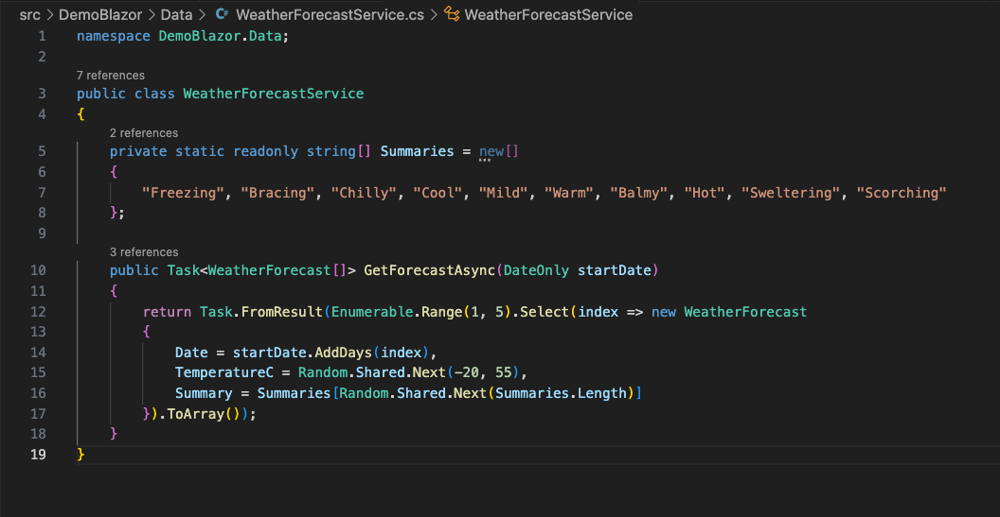

From here, I wanted to enhance this basic setup with some real-world monitoring capabilities. This is where observability comes in: rather than relying on gut feeling (or the infamous "it works on my machine" excuse), observability lets us know exactly what's happening under the hood when things go wrong. And in Agile, where bugs are lurking in every sprint, observability is invaluable because we are able to intergate the internal state of our system.

## Getting Cozy with OTEL and Coralogix
Now, the goal was to pump some telemetry data (traces, metrics, and logs) from my "DemoBlazor" app to Coralogix using OTEL. With OpenTelemetry being a kind of universal adapter for observability, the integration was actually pretty smooth. I just needed to install a few packages and configure endpoints and API keys in appsettings.json.

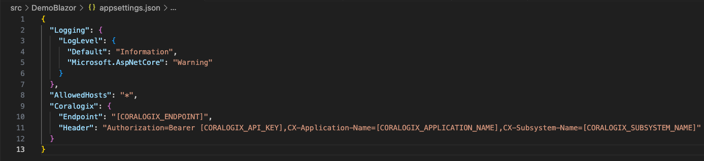

### Signing Up with Coralogix and Creating an API Key
Next up was Coralogix. To actually send telemetry data somewhere, I needed a platform to ingest, analyse, and visualise it. That’s where Coralogix came in. 

Here’s what I did:

* Coralogix Free Trail Sign Up: I created a free Coralogix account by visiting [Coralogix](https://coralogix.com/) and signing up with an email and password.

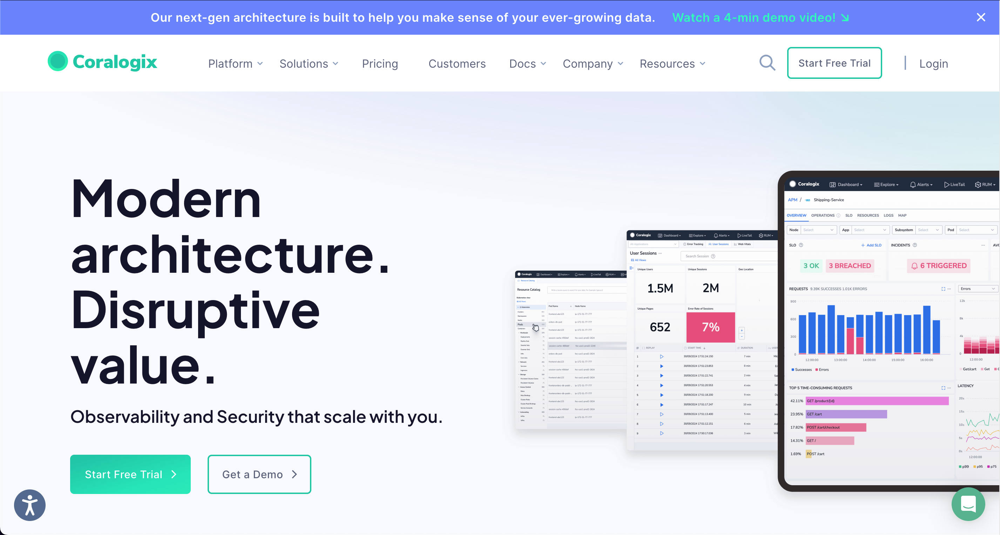

* Create an API Key: Once signed up, I navigated to DataFlow > API Keys 

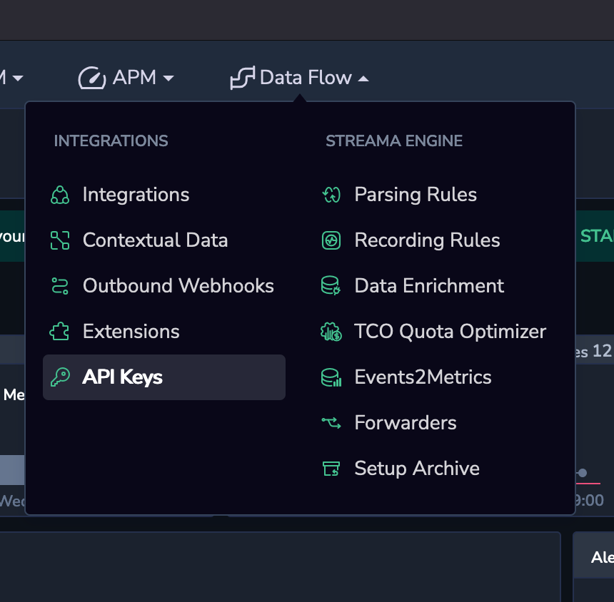

to generate a new key for my Blazor app.

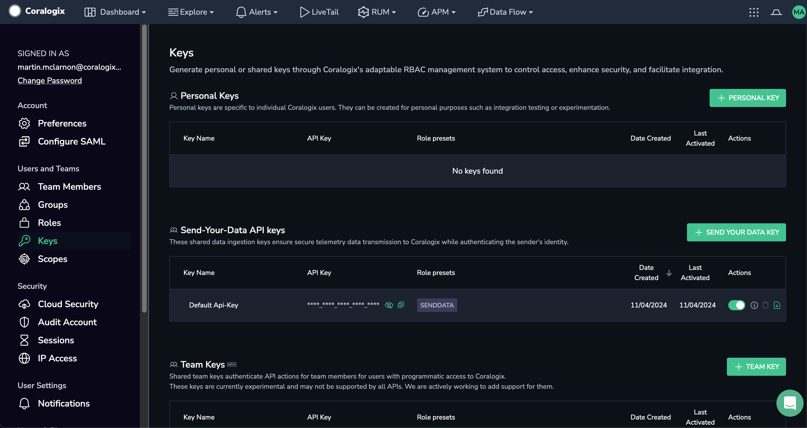

I clicked on "SEND YOUR DATA KEY"

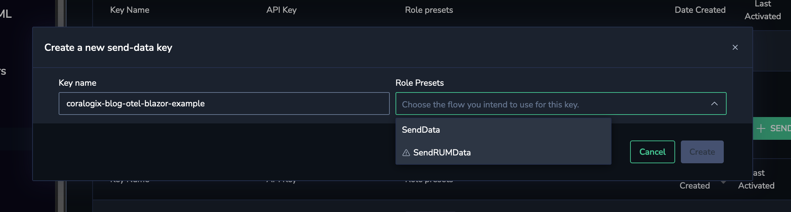

gave the API key a relevant name, I just gave it the name of the demo solution; "coralogix-blog-otel-blazor-example", and chose the "SendData" flow for the key and clicked "Create".

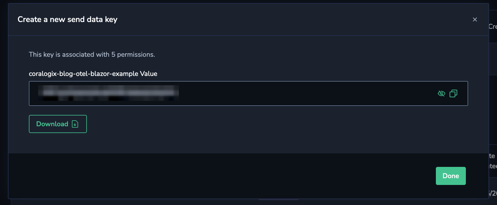

I now had my API key which I could copy or download in a JSON format. For this demo I just copied it for my ```appsettings.json``` file.

This API key acts as a unique identifier, linking my "DemoBlazor" app’s telemetry data to my Coralogix account.

With Coralogix's fantasticlly simple set up and my API key in hand, I could start configuring my "DemoBlazor" app to send telemetry data (traces, metrics, and logs) directly to Coralogix. This setup would give me a full view of my "DemoBlazor" app’s health in Coralogix — but first, I had to make sure I was collecting data worth viewing!

## Integrating OpenTelemetry (OTEL) for Observability
OpenTelemetry (OTEL) is a vendor-neutral, open-source tool that simplifies observability by standardising telemetry data (traces, metrics, and logs).

Using OTEL with .NET 9.0 was straightforward and only required a few NuGet packages. 

* ```OpenTelemetry.Extensions.Hosting```: Provides foundational integration with the .NET hosting environment, enabling centralised configuration for OpenTelemetry.
* ```OpenTelemetry.Exporter.OpenTelemetryProtocol```: Exports data to an OTLP-compatible backend like Coralogix.
* ```OpenTelemetry.Instrumentation.AspNetCore```: Captures request lifecycle data in ASP.NET Core applications automatically.
* ```OpenTelemetry.Instrumentation.Http```: Tracks outgoing HTTP requests to external services, providing visibility into dependencies.

```bash
$ cd ./src
$ dotnet add ./DemoBlazor/DemoBlazor.csproj package OpenTelemetry.Extensions.Hosting
$ dotnet add ./DemoBlazor/DemoBlazor.csproj package OpenTelemetry.Exporter.OpenTelemetryProtocol
$ dotnet add ./DemoBlazor/DemoBlazor.csproj package OpenTelemetry.Instrumentation.AspNetCore
$ dotnet add ./DemoBlazor/DemoBlazor.csproj package OpenTelemetry.Instrumentation.Http
```

### Configure OpenTelemetry for Tracing, Metrics and Logging

To make the observability data interesting, I created three razor pages: 

```bash
./Pages/FetchTracing.razor
./Pages/FetchMetrics.razor
./Pages/FetchLogging.razor 
```

Adding some flavour: Tracing, Metrics and Logging by extending the default project ```./Pages/FetchData.razor```

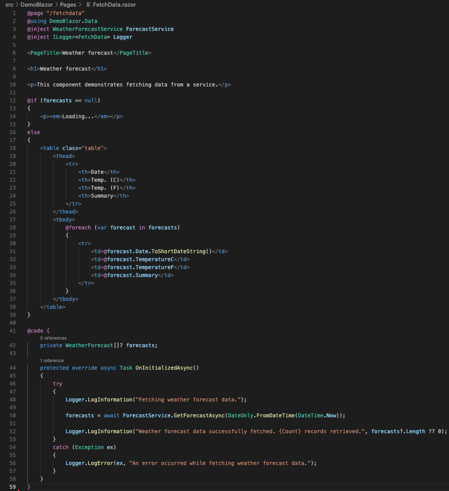

#### Tracing Setup
Tracing follows the path of a request as it travels through various services and components within a system, capturing each step along the way. Distributed tracing, specifically, is crucial in microservices architectures, where a single request might touch numerous services before completing.

In Agile, tracing offers visibility into how requests flow through complex systems, helping me identify where latencies occur and optimising these paths. Tracing is crucial for understanding the interdependencies and timing of components, which is especially useful for complex, multi-service environments.

```bash
./Pages/FetchTracing.razor
```

Tracing allows me to pinpoint exactly where requests are slowing down or failing. By examining traces, I can uncover service interactions, bottlenecks, or failing dependencies that might be affecting overall performance. Tracing enables a fine-grained view of request behavior, critical for understanding and resolving issues in real-time.

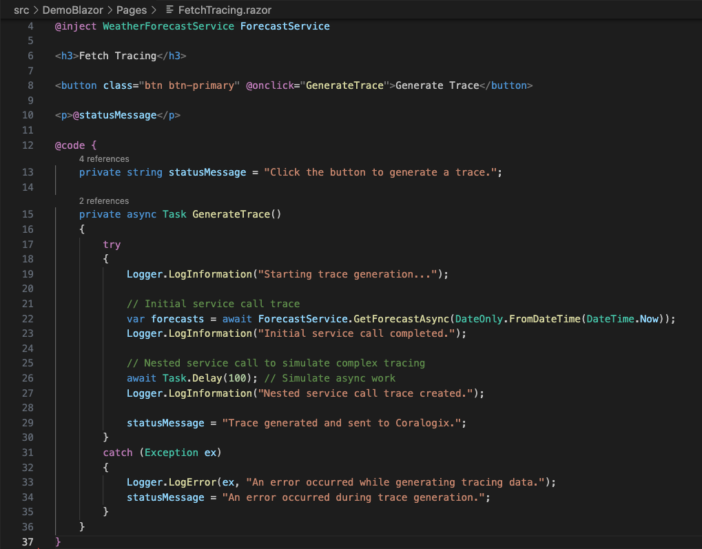

FetchTracing was where things got interesting. I set up a nested call to simulate real-world tracing — the kind you’d encounter when debugging multi-step processes. With OTEL, I could follow each call step-by-step and see where things were slowing down or breaking.

#### Metrics Setup
Metrics are quantitative measurements that reflect the health and performance of a system over time. They are often represented as numerical values (e.g., CPU usage, memory consumption, response time, request rate) and are critical for understanding system performance and capacity.

In Agile, metrics provide quick snapshots of the system’s performance and are essential for monitoring capacity, SLAs, and efficiency. By examining metrics, I can proactively identify trends (such as increasing memory usage) before they become critical issues, supporting continuous improvement.

```bash
./Pages/FetchMetrics.razor
```

Metrics are invaluable in root cause analysis because they can reveal when performance bottlenecks or resource constraints began, narrowing down the scope of investigation. For instance, a sudden CPU spike in metrics could indicate a misbehaving service or loop.

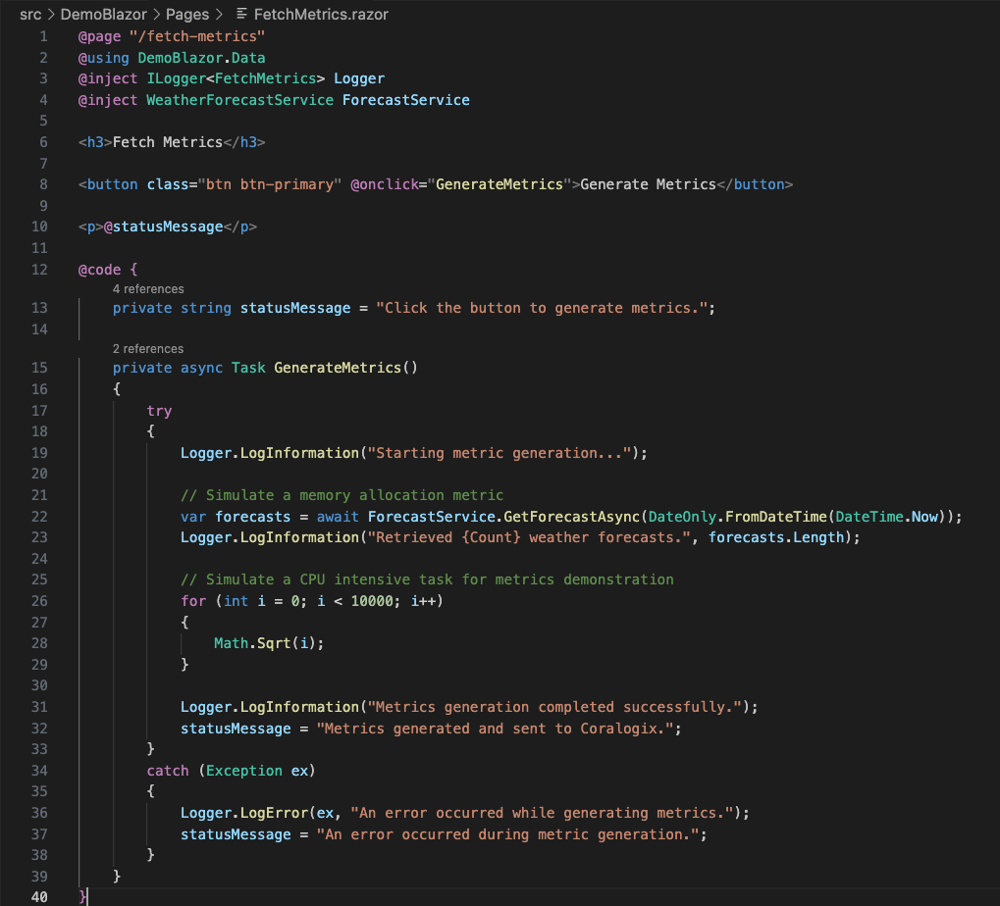

FetchMetrics, generates CPU and memory metrics. Nothing fancy, just some simulated loops and mock data to showcase what metrics could look like in Coralogix.

#### Logging Setup

Logging is the recording of discrete events or messages generated by applications and systems. Logs capture details about specific operations, errors, and decisions, providing a narrative of what’s happening within the code.

In Agile, logs are invaluable for tracking detailed application behavior, especially when debugging or understanding specific issues. Logs provide detailed, context-rich information that I can use to diagnose unexpected behaviors or errors.

```bash
./Pages/FetchLogging.razor
```

 Logs are often the first place I look to understand why a problem occurred. With detailed logs, it’s possible to pinpoint exact errors, understand how code executed, and trace through error messages and exceptions. Logs provide context that complements metrics and traces by revealing specific error messages or decisions made by the system.

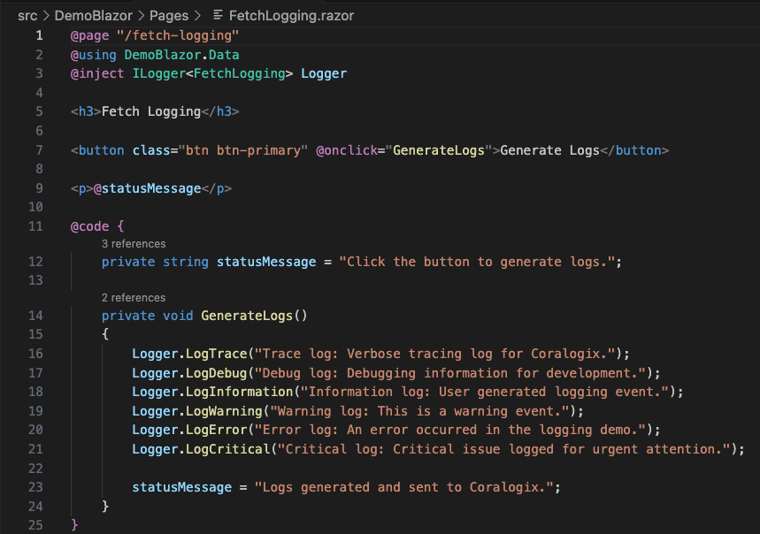

FetchLogging, on the other hand, lets me experiment with logs of all levels: Info, Debug, Warning, and my personal favourite — Critical! 

With all three pages in place, my humble weather app was now generating enough observability telemetry data (traces, metrics, and logs) to make Sherlock Holmes proud.

## Coralogix and the Return-on-Investment: Observe, Orientate, Decide, Act


## Observability’s Secret Weapon: Root Cause Analysis

Here’s the beauty of observability: when something goes wrong, I don’t have to rely on guesswork. All that OTEL data flows to Coralogix, where I can trace issues back to their root causes with actual data, not assumptions. 

In an Agile setting, this kind of insight can save hours if not days of back-and-forth troubleshooting. Having traces, metrics and logs at my fingertips means I can spot the exact point of failure, down to the millisecond.

## Taking It Further

For those already running a Blazor app, adding observability could be your next power move. Just bring in OTEL for traces, metrics and logs, set up Coralogix, and add custom metrics for key user actions. Want even more control? Try adding alerting in Coralogix to automatically notify you of anomalies. Trust me, once you get a taste of observability, there’s no going back. Who knew debugging could be this fun?

In the end, I may be new to .NET 9.0 and Blazor but with OTEL and Coralogix on my side, I can tackle any bug that comes my way.